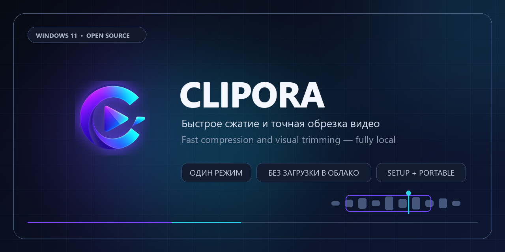
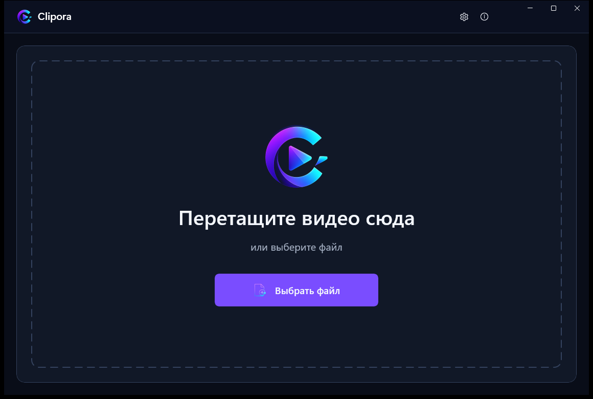
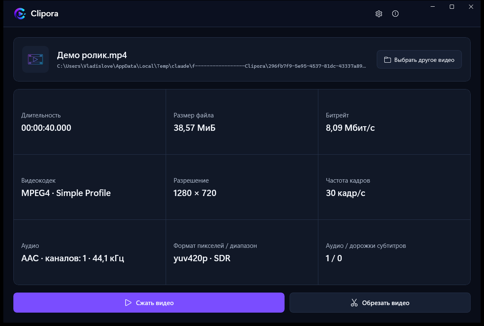
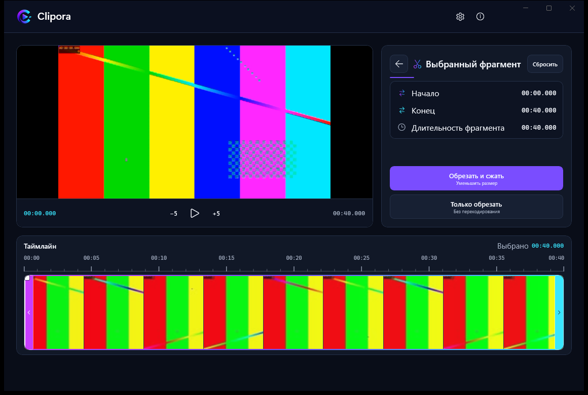
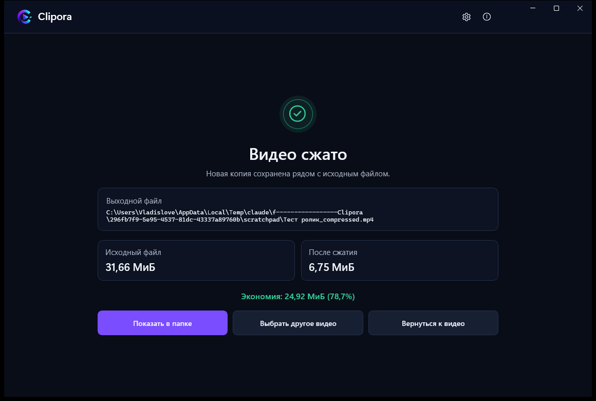

<p align="center">
  
</p>

<p align="center">
  <a href="https://github.com/Vlad0s78/Clipora/actions/workflows/ci.yml"></a>
  <a href="https://github.com/Vlad0s78/Clipora/releases/latest"></a>
  
  
  <a href="LICENSE"></a>
</p>

<p align="center">
  <b>Сжимайте и обрезайте видео в один клик. Локально, без облака, без настроек кодеков.</b><br>
  <sub><a href="#english">🇬🇧 English version below</a></sub>
</p>

---

## Русский

**Clipora** уменьшает размер видео, сохраняя картинку визуально близкой к оригиналу. Приложение само находит лучший доступный кодировщик вашей видеокарты, поэтому вам не нужно разбираться в пресетах, битрейтах и профилях — достаточно перетащить файл в окно.

<p align="center">
  
</p>

### Возможности

| | |
|---|---|
| **Сжать видео** | Обработать файл целиком одним нажатием |
| **Обрезать и сжать** | Выбрать фрагмент на таймлайне и получить компактную копию |
| **Только обрезать** | Сохранить выбранную часть без перекодирования, мгновенно |
| **Локально** | Исходник не изменяется и никуда не загружается |
| **Проводник** | Пункты «Открыть в Clipora» и «Сжать с помощью Clipora» в контекстном меню |
| **Portable** | Версия, которая не пишет в реестр и хранит данные рядом с собой |

### Как это выглядит

<table>
  <tr>
    <td width="50%"></td>
    <td width="50%"></td>
  </tr>
  <tr>
    <td align="center"><sub>Полные сведения о файле до обработки</sub></td>
    <td align="center"><sub>Таймлайн с кадрами, предпросмотр, точная обрезка</sub></td>
  </tr>
  <tr>
    <td colspan="2"></td>
  </tr>
  <tr>
    <td colspan="2" align="center"><sub>Результат: сколько места освободилось</sub></td>
  </tr>
</table>

### Как это работает

Clipora пробует кодировщики по порядку и берёт первый рабочий:

```
AV1:  av1_nvenc  →  av1_qsv  →  av1_amf      (NVIDIA / Intel / AMD)
HEVC: hevc_nvenc →  hevc_qsv →  hevc_amf
Запас: libsvtav1                              (программный, если видеокарта не подошла)
```

Кодирует видеочип, а не процессор, поэтому сжатие идёт быстро и почти не нагружает систему. Качество задано фиксированным профилем (AV1 CQ 35, HEVC CQ 30) — он подобран так, чтобы разница с оригиналом была незаметна глазу при кратном уменьшении размера. Звук перекодируется в AAC 128 kbps.

Режим **«Только обрезать»** копирует потоки без перекодирования (`-c copy`): потери качества нет вообще, а обработка занимает секунды независимо от длины видео.

### Установка

Скачайте с [GitHub Releases](https://github.com/Vlad0s78/Clipora/releases/latest):

- **`clipora-win64-setup.exe`** — обычная установка, добавляет пункты в контекстное меню Проводника.
- **`clipora-win64-portable.zip`** — распакуйте и запустите `Clipora.exe`. Ничего не пишет в реестр, все данные хранит в папке `portable-data`.

FFmpeg уже входит в оба варианта — доустанавливать ничего не нужно.

**Требования:** Windows 11 x64. Для аппаратного ускорения — видеокарта с поддержкой AV1 или HEVC (NVIDIA GTX 1650+, Intel Arc / UHD 7-го поколения+, AMD RX 5000+). Без такой видеокарты сжатие тоже работает, но медленнее.

### Приватность

Видео обрабатывается только на вашем компьютере. Clipora не подключается к сети, не отправляет телеметрию и не изменяет исходный файл — результат всегда сохраняется отдельной копией.

### Сборка из исходников

Нужны [.NET SDK 10](https://dotnet.microsoft.com/download) и PowerShell 7:

```powershell
dotnet restore Clipora.sln --locked-mode
pwsh -NoProfile -File src/Clipora.Packaging/scripts/Get-VerifiedMediaTools.ps1 -Development
dotnet build Clipora.sln -c Release --no-restore
dotnet test Clipora.sln -c Release --no-build --no-restore
```

Второй командой скачиваются бинарники FFmpeg с проверкой SHA-256 по [`ffmpeg/PROVENANCE.json`](ffmpeg/PROVENANCE.json) — в репозитории их нет. Для сборки Setup и Portable установите Inno Setup 6 и запустите `src/Clipora.Packaging/scripts/Build-Packages.ps1`.

Архитектура и соглашения описаны в [CLAUDE.md](CLAUDE.md).

---

<a name="english"></a>

## English

**Clipora** shrinks video files while keeping them visually close to the original. It picks the best encoder your GPU offers, so there are no presets, bitrates or codec profiles to configure — just drop a file into the window.

### Features

| | |
|---|---|
| **Compress** | Process the whole file in one click |
| **Trim & compress** | Pick a range on the timeline and get a compact copy |
| **Trim only** | Keep the selected part without re-encoding, instantly |
| **Private by design** | Source files stay unchanged and never leave your PC |
| **Explorer integration** | "Open in Clipora" and "Compress with Clipora" context menu entries |
| **Portable build** | Touches no registry, keeps its data next to the executable |

### How it works

Clipora probes encoders in order and takes the first one that works:

```
AV1:      av1_nvenc  →  av1_qsv  →  av1_amf     (NVIDIA / Intel / AMD)
HEVC:     hevc_nvenc →  hevc_qsv →  hevc_amf
Fallback: libsvtav1                              (software, if no GPU encoder fits)
```

Encoding runs on the GPU, so it is fast and leaves the CPU free. Quality is a fixed profile (AV1 CQ 35, HEVC CQ 30) chosen to stay visually indistinguishable while cutting file size several times over. Audio is re-encoded to AAC 128 kbps. **Trim only** copies streams as-is (`-c copy`) — no quality loss at all, and it finishes in seconds.

### Install

Download from [GitHub Releases](https://github.com/Vlad0s78/Clipora/releases/latest):

- **`clipora-win64-setup.exe`** — standard installer with Explorer integration.
- **`clipora-win64-portable.zip`** — extract and run `Clipora.exe`.

FFmpeg is bundled in both. Requires Windows 11 x64.

### Build from source

Requires .NET SDK 10 and PowerShell 7:

```powershell
dotnet restore Clipora.sln --locked-mode
pwsh -NoProfile -File src/Clipora.Packaging/scripts/Get-VerifiedMediaTools.ps1 -Development
dotnet build Clipora.sln -c Release --no-restore
dotnet test Clipora.sln -c Release --no-build --no-restore
```

---

<p align="center">
  <sub>
    Windows 11 x64 · WinUI 3 · .NET 10 · FFmpeg 8.1 LGPL ·
    <a href="LICENSE">MIT License</a> ·
    <a href="THIRD_PARTY_NOTICES.md">Third-party notices</a>
  </sub>
</p>
